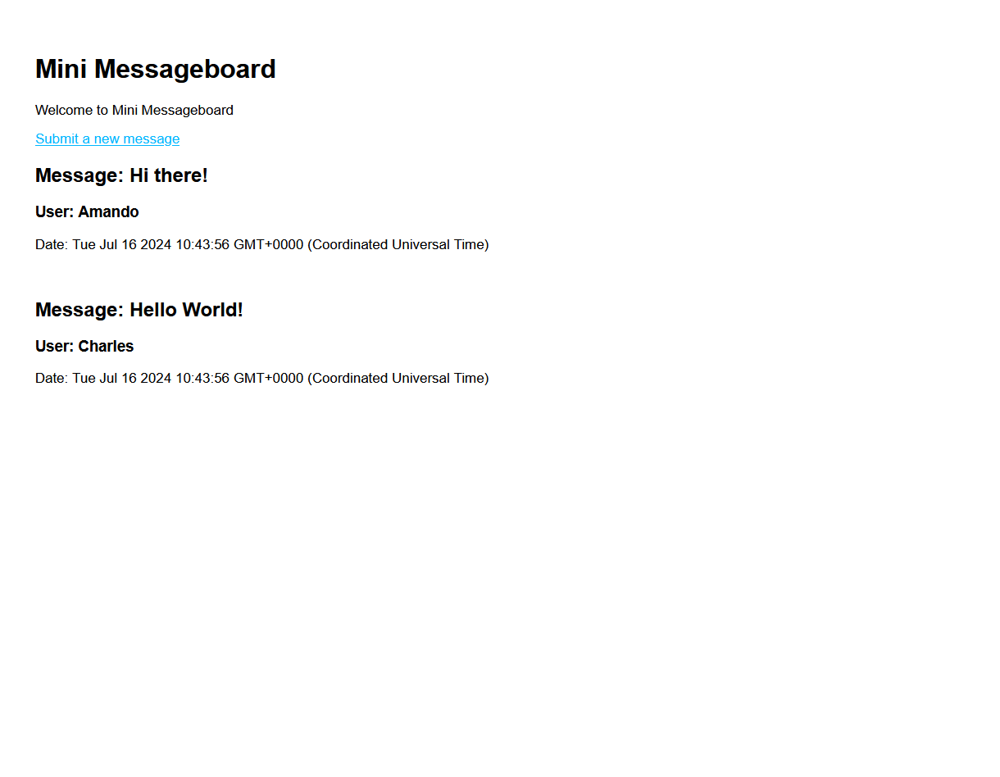

# Mini Message Board

This project uses EJS as a templating language for the frontend and Express + NodeJS for the backend. The project aims to practice creating interactive web apps using Express.

## The Odin Project: Lesson Mini Message Board

This project is build according to the specification of the [Mini Message Board lesson](https://www.theodinproject.com/lessons/nodejs-mini-message-board)

## Preview

The message board takes the name and message of a user and displays it on the home page.

## Run locally

*In order to run project locally NodeJS + Git needs to installed on your system*

Follow these steps on Mac/Linux/WSL to run the project locally:

1. Open a terminal and go to a directory you want the repository to be in
2. Select Code in the Github project page and copy the SSH URL
3. git clone *SSH URL*
4. 'cd' into the repository you just cloned
5. Run 'npm install'
6. Run 'npm run serverstart'
7. Open 'localhost:3000' in your browser
